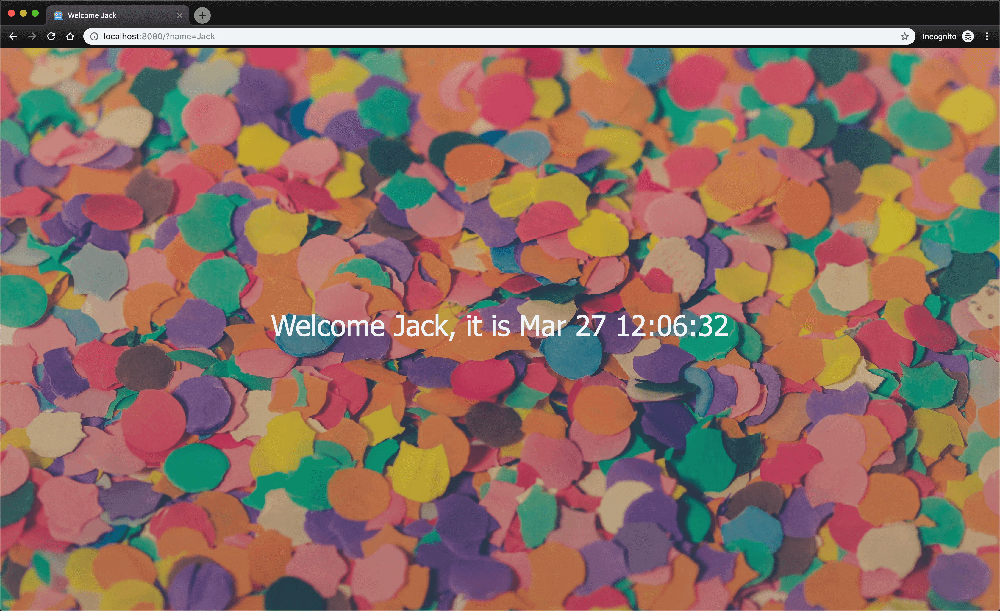

# autoapp 🤖

[](https://github.com/derekahn/autoapp/LICENSE)
[](https://goreportcard.com/report/github.com/derekahn/autoapp)
[](https://cloud.drone.io/derekahn/autoapp)
[](https://quay.io/repository/derekahn/autoapp)


An example of CI/CD with a simple go application.

## Run

### 🐳ized

```bash
# creates a new image
$ make build

# runs the image
$ make run
```

### 🐹ized

```bash
# installs deps etc
$ make install

# execute binary
$ ./bin/cmd
```

## Example



## Environment Variables

```console
# defaults to "8080"
PORT=3000

# defaults to "Gopher"
NAME="Edgar Allan Poe"
```

## Commands

Run `make help` to list available commands:

```console
  $  make help

Choose a command run in autoapp:

  install    Install missing dependencies. Builds binary in ./bin
  build      Creates a docker image of the app
  run        Runs the current docker image on port 8080
  clean      Clean build files. Runs `go clean` internally
  fmt        Runs gofmt on all source files
  test       Runs all the tests.
  coverage   Tests code coverage
  missing    Displays lines of code missing from coverage
```

## CI/CD How To 🧙

This tutorial assumes you have access to the [Google Cloud Platform](https://cloud.google.com). While GCP is used for basic infrastructure requirements the lessons learned in this tutorial can be applied to other platforms.

> It's not a requirement. But reading through this tutorial will be easier and available offline utilizing [vmd](https://www.npmjs.com/package/vmd). It requires [node.js](https://nodejs.org/en/) installed which you can do with `$ brew install node` and then `$ npm install -g vmd`. Then in the root of the project `$ cd ~/<WORK_DIR>/autoapp/ && vmd`.

| Section                                                | Description                                                                                                              |
| ------------------------------------------------------ | ------------------------------------------------------------------------------------------------------------------------ |
| [Prerequisites](docs/00-prerequisites.md)              | Preface, disclaimers and setting expectations                                                                            |
| [Installing the Client Tools](docs/01-client-tools.md) | Setup and install of CLIs required                                                                                       |
| [Creating A New Cluster](docs/02-create-cluster.md)    | Creating and connecting to a [GCP](https://cloud.google.com/) [GKE](https://cloud.google.com/kubernetes-engine/) cluster |
| [Deploying Spinnaker](docs/03-deploy-spinnaker.md)     | Deploying [Spinnaker](https://www.spinnaker.io/) to our cluster                                                          |
| [Setting up Quay](docs/04-setup-quay.md)               | Step by step configuration for [Quay](https://quay.io)'s hooks                                                           |
| [Setting up Spinnaker](docs/05-setup-spinnaker.md)     | Step by step configuration for spinnaker to automate deployments                                                         |
| [Setting up CI](06-setup-CI.md)                        | Wire up a simple `CI` pre-merge check                                                                                                |
