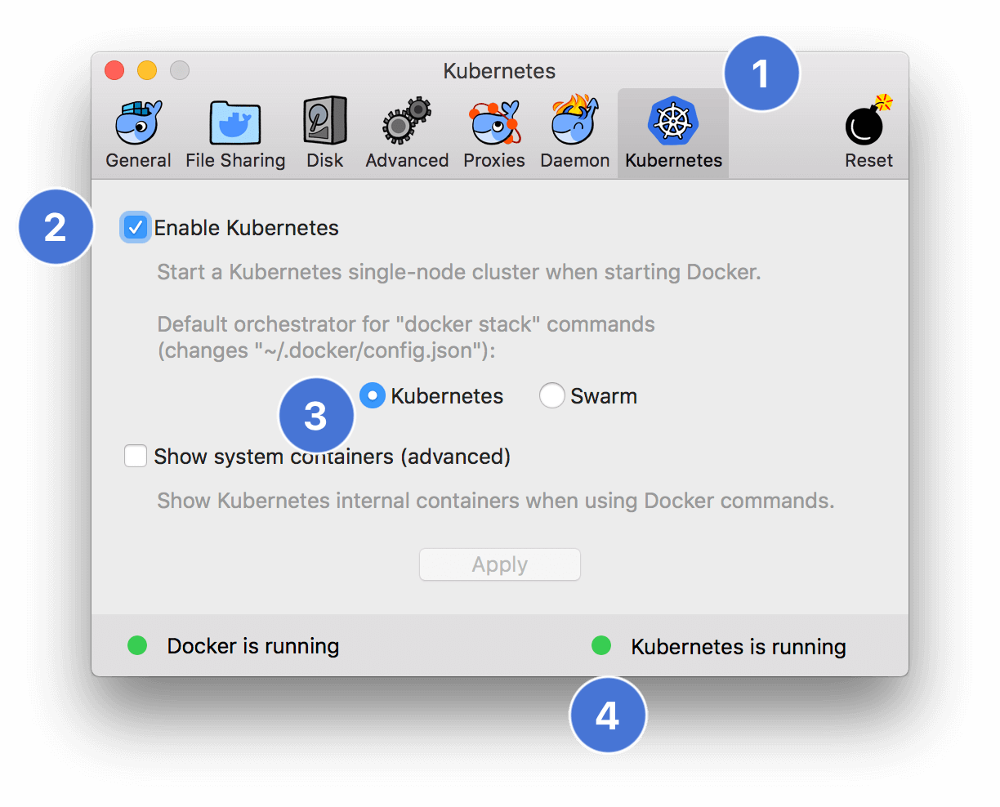

# Prerequisites

## Preface

### Goal 🥅

Attempting to create a step-by-step walkthrough in creating an effiecient CI/CD process utilizing this simple 🐹 app.

> Basically focusing on the process and automation of getting source code deployed.

### !Goal ✋

There is minimal emphasis on security 🔒, from setting up a ☸️ cluster to exposing and safely utilizing external services as well as exposing this simple 🐹 application.

> Basically the focus is on learning, implementing and understanding the flow/transition of source code to deployment

## Assumptions

- You're Comfortable with a command line? `$ su`
- You have a [Quay](https://quay.io) account
- [🐳 Docker (>= v18.09)](https://www.docker.com/get-started) is installed and setup on your 💻 and you [know what it is](https://medium.com/pintail-labs/docker-series-what-is-docker-9eddca88f434) and [how to use it](https://medium.com/@Jernfrost/what-is-docker-and-does-it-have-benefits-for-desktop-developers-3dc06ef6870e)
- Some basic ☸️[ kubernetes](https://hackernoon.com/what-is-kubernetes-how-to-get-started-with-it-93e6815c0b6e) know-how: [pods](https://kubernetes.io/docs/concepts/workloads/pods/pod-overview/), [deployments](https://kubernetes.io/docs/concepts/workloads/controllers/deployment/), [services](https://kubernetes.io/docs/concepts/services-networking/service/), etc.

## kubernetes enabled on 🍎

## Sections

| Next                                              |
| ------------------------------------------------- |
| [Installing the Client Tools](01-client-tools.md) |
